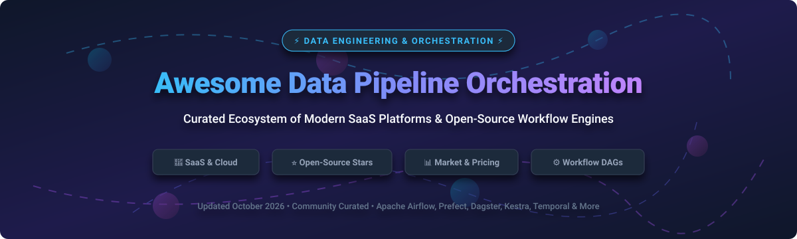

# 🚀 Awesome Data Pipeline Orchestration   

## 🌐 Modern Data Pipeline & Workflow Orchestration Ecosystem

> A curated, comprehensive landscape of **Data Pipeline Orchestration**, **Workflow Scheduling**, **Software-Defined Assets**, **Event-Driven Workflows**, and **Cloud Managed Orchestrators**.

📅 **Last updated: October 2026**

---

### 💡 Overview & Market Landscape

Data pipeline orchestration systems schedule, run, monitor, and retry complex workflows across data warehouses, lakes, streaming engines, and microservices. Whether building ETL/ELT pipelines, machine learning workflows, or event-driven business operations, choosing the right orchestrator is critical for data platform performance and reliability.

---

## 📑 Table of Contents

- [📊 SaaS & Hosted Platforms Market Analysis](#-saas--hosted-platforms)
- [⭐ Open-Source GitHub Projects](#-open-source-github-projects)
- [🎯 Choosing the Right Orchestrator](#-choosing-the-right-orchestrator)
- [🤝 How to Contribute](#-how-to-contribute)
- [💖 Support & Sponsorship](#-support--sponsorship)
- [⚠️ Disclaimer](#%EF%B8%8F-disclaimer)

---

## 📊 SaaS & Hosted Platforms

### 📈 Sector Market Size & Structure Analysis

> 💡 **Market Size Estimate**: The Global Data Pipeline Orchestration & Workflow Automation Market is estimated at **$7.5 Billion to $9.2 Billion** (2026), growing at a CAGR of ~22-25% driven by cloud migration, AI/ML pipeline demands, and real-time streaming architectures.
> 
> 🔄 **Market Structure**: The sector is **moderately fragmented**. While legacy enterprise scheduling (e.g., Control-M) holds major enterprise market share, the modern cloud-native layer is fiercely contested among open-source commercial entities (Astronomer/Airflow, Prefect, Dagster+) and hyperscalers (AWS MWAA, Google Cloud Composer). It is **not a winner-take-all market** due to diverse architectural paradigms (DAG-based, asset-oriented, event-driven, microservice execution).

Below is a breakdown of top managed SaaS offerings sorted by **Company Size / Valuation / Estimated Revenue** (descending):

| 🏢 Platform | 📝 Description | 💰 Estimated Revenue / Valuation / Size | 💵 Starting Price | 🎁 Free Tier / Trial Limit |
| :--- | :--- | :--- | :--- | :--- |
| **[Control-M Cloud (BMC)](https://www.bmc.com/it-solutions/control-m.html)** | Enterprise workload automation and orchestration with strong mainframe-to-cloud scheduling heritage. | **~$2.0 Billion Revenue** (BMC Software parent size) | $2,400/month (billed annually; Starter Pack SaaS up to 500 executions/mo) | No free trial (guided product demos & evaluation POC available) |
| **[Google Cloud Composer](https://cloud.google.com/composer)** | Fully managed Apache Airflow service on Google Cloud Platform with native GCP integrations. | **Hyper-scaler tier** ($100B+ GCP parent business) | ~$0.35/hour environment management fee + compute/storage (Composer 2) | No permanent free tier (eligible for Google Cloud $300 / 90-day free trial credit) |
| **[Apache Airflow MWAA (Amazon)](https://aws.amazon.com/managed-workflows-for-apache-airflow/)** | AWS Managed Workflows for Apache Airflow—fully managed Airflow environments on AWS. | **Hyper-scaler tier** ($100B+ AWS parent business) | ~$0.33/hour (~$240/month; Micro environment base rate) | No free tier (free AWS MWAA Local Runner available for local development) |
| **[Astronomer](https://www.astronomer.io/)** | Managed Apache Airflow platform (Astro) with enterprise support, observability, and cloud-native deployments. | **Valuation: ~$1.0 Billion** (Series C, $100M+ raised) | $0.35/hour per deployment + $0.13/hour per worker (Developer plan) | 14-day free trial |
| **[Prefect Cloud](https://www.prefect.io/)** | Managed orchestration for Python-first, dynamic workflows with hybrid execution and a modern control plane. | **Valuation: ~$250 Million+** (Series B, $50M+ raised) | $100/month (Starter plan; includes 3 users, 20 deployments) | Free forever Hobby plan (up to 2 users, 5 deployments, 500 serverless execution mins/month, 7-day run retention) |
| **[Dagster Cloud / Dagster+](https://dagster.io/)** | Managed asset-oriented orchestration platform built around software-defined assets and strong observability. | **Valuation: ~$150 Million+** (Series B, $35M+ raised) | $10/month base fee + $0.040/credit (Solo plan) | Free entry-level plan for evaluation/prototyping + 30-day free trial |
| **[Orkes Conductor](https://orkes.io/)** | Managed Netflix Conductor–based workflow orchestration for microservices and data workflows. | **Valuation: ~$100 Million+** (Series A, $20M+ raised) | Custom cluster-based enterprise pricing | Free Developer Edition / Playground sandbox (unlimited evaluation use for individuals) |
| **[Kestra](https://kestra.io/)** | Declarative, language-agnostic orchestration platform (open-source core + enterprise/cloud offerings). | **Valuation: ~$40 Million+** (Seed/Series A, $10M+ raised) | Annual custom subscription (Cloud / Enterprise) | Free open-source edition (self-hosted) or early access Cloud trial program (up to 2 months free) |
| **[Flyte](https://flyte.org/)** (Union.ai) | Cloud-native workflow orchestrator optimized for data, AI, and ML pipelines on Kubernetes. | **Valuation: ~$35 Million+** (Seed/Series A via Union.ai) | Custom usage-based / Enterprise pricing (via Union Cloud) | Free open-source edition / local DevBox + 30-day free trial on AWS Marketplace |
| **[Mage Pro](https://www.mage.ai/)** | Managed offering around the Mage open-source data pipeline platform for building and running pipelines. | **Valuation: ~$20 Million+** (Seed round, $5M+ raised) | $29/month + $0.50/CPU-hour (Starter plan) | 7-day free trial (no credit card required) |

---

## ⭐ Open-Source GitHub Projects

Orchestration is one of the strongest open-source software categories in data engineering. Below is the curated list of open-source workflow engines, sorted by **GitHub Star Count** (descending):

| 📦 Project & Repo | ⭐ GitHub Stars | 📄 Description & Key Capabilities |
| :--- | :--- | :--- |
| **[Apache Airflow](https://github.com/apache/airflow)** |  | The industry standard open-source workflow orchestrator for scheduled batch data pipelines with a massive provider ecosystem. |
| **[Argo Workflows](https://github.com/argoproj/argo-workflows)** |  | Open-source Kubernetes-native workflow engine for orchestrating parallel containerized jobs and data processing tasks. |
| **[Prefect](https://github.com/PrefectHQ/prefect)** |  | Python-native orchestration framework designed for dynamic, code-as-workflows with a high-performance hybrid model. |
| **[Temporal](https://github.com/temporalio/temporal)** |  | Open-source durable execution platform ideal for long-running, resilient distributed applications and complex data flows. |
| **[Netflix Conductor](https://github.com/Netflix/conductor)** |  | Microservices and workflow orchestration engine originally developed by Netflix for high-throughput distributed systems. |
| **[Dagster](https://github.com/dagster-io/dagster)** |  | Asset-centric data orchestrator treating data assets as first-class citizens with declarative lineage and testing tools. |
| **[Mage](https://github.com/mage-ai/mage-ai)** |  | Open-source data pipeline tool for building, running, and managing ETL/ELT pipelines with a interactive notebook experience. |
| **[Kestra](https://github.com/kestra-io/kestra)** |  | Declarative, event-driven orchestration engine using simple YAML workflow definitions and polyglot execution. |
| **[Flyte](https://github.com/flyteorg/flyte)** |  | Kubernetes-native structured workflow orchestrator tailored for machine learning, deep learning, and data engineering pipelines. |
| **[Luigi](https://github.com/spotify/luigi)** |  | Python package built by Spotify for building complex pipelines of batch jobs, handling dependency resolution and visualization. |
| **[Kedro](https://github.com/kedro-org/kedro)** |  | Open-source Python framework for creating reproducible, maintainable, and modular data science and data engineering code. |
| **[Snakemake](https://github.com/snakemake/snakemake)** |  | Workflow management system based on Python/Make syntax, widely used in bioinformatics and large data processing. |

---

## 🎯 Choosing the Right Orchestrator

Selecting a workflow engine depends on your stack, infrastructure team size, and architecture preferences:

- ⚙️ **Choose Apache Airflow** for maximum community ecosystem, extensive cloud integrations, and standard scheduled batch DAGs.
- 🐍 **Choose Prefect** for Python-first code, dynamic runtime execution, and minimal boilerplate configuration.
- 📦 **Choose Dagster** for software-defined data assets, built-in data lineage, unit testing, and asset observability.
- 📄 **Choose Kestra** for declarative YAML-based workflows, language-agnostic tasks, and event-driven automation.
- ☸️ **Choose Flyte or Argo** for Kubernetes-native execution, containerized tasks, and heavy AI/ML pipelines.
- 🛡️ **Choose Temporal** for durable state execution, microservice sagas, and long-running distributed processes.

---

## 🤝 How to Contribute

Contributions are welcome! Help keep this awesome list up to date:

1. 🍴 Fork the repository.
2. ✏️ Add or update entries in `README.md` keeping formatting consistent.
3. 📝 Ensure accuracy of pricing, valuation, and GitHub repository links.
4. 📬 Submit a Pull Request (PR) with a clear description of changes.

---

## 💖 Support & Sponsorship

Thank you for visiting this repository! If you found this list helpful for evaluating or choosing your data pipeline orchestration stack, please consider supporting the project:

- ⭐ **Star** this repository to show your appreciation and help others discover it.
- 🔀 **Fork** it to contribute additions or customize it for your team.
- 📢 **Share** it with your fellow data engineers, platform architects, and MLOps teams!
- ☕ **Buy Me a Coffee / Sponsor**: Consider supporting ongoing maintenance via the [GitHub Sponsor Dashboard](https://github.com/sponsors/ishandutta2007).

---

## ⚠️ Disclaimer

- This repository is a **community-curated overview** intended for educational and analytical purposes.
- Valuations and pricing details reflect public market disclosures, funding round reports, and standard SaaS listings as of October 2026.

---

## 📈 Star History

---

<b>Made with ❤️ for Data Engineers, MLOps Professionals, and Analytics Engineers.</b>

